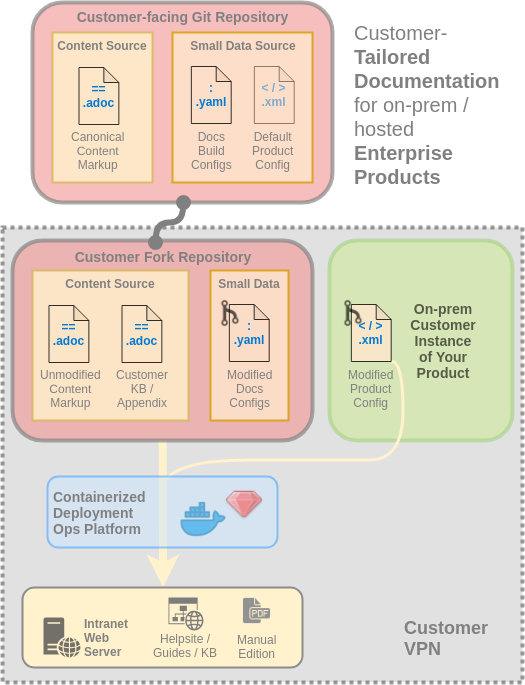

= LiquiDoc Ops
:idprefix:
:idseparator: -
:icons: font
ifndef::env-github[]
:toc: left
endif::[]
ifdef::env-github,env-browser[]
:toc: macro
:toclevels: 2
endif::[]
ifdef::env-github[]
:!toc-title:
:caution-caption: :fire:
:important-caption: :exclamation:
:note-caption: :paperclip:
:tip-caption: :bulb:
:warning-caption: :warning:
endif::[]
:landing-page_url: https://www.agyl.dev
:landing-page_link: link:{landing-pagee_url}[landing page]

In Fall 2019, this space will become the new home of the link:https://github.com/DocOps/liquidoc-cmf[LiquiDoc Content Management Framework] project, now to be called simply *LiquiDoc Ops* or *LDOps* for short.
The developer has spent the summer revamping various dependencies and adding a major new one.
Updates will be posted here and on https://twitter.com/_codewriting[Twitter] in the meantime.

To learn more about the plan, see the new {landing-page_link}.

.The LiquiDoc Ops Ecosystem
image::https://www.agyl.dev/img/agyl-ghaanja-diagram.png[]

The rest of this document is pretty well subject to change, but I have been fielding a lot of requests and figured it makes sense to put it all in one place.
What could go wrong?

In any case, everything below is where I think things are going, but I'm working agile and lean, and very fast, so this is subject to change, and it could take a week or more to get updated.

== High-level Roadmap

The following major components lined up for release:

. *LiquiDoc*, the AGYL CLI utility, release 0.12.0 with new GraphQL and Liquid powers.
. *Ganja*, the new DocOps CLI that will ship with LiquiDoc, GitHub, Netlify, and Algolia integrations.
. The *LiquiDoc Ops framework* codebase itself, including a basic specification, boilerplate templates, schemas, scripts, and other libraries.
. A LiquiDoc-ready Jekyll layout/theme set, tentatively called *DocOps Reboot*, for generating a complete documentation site, including a REST API reference and a YAML/Liquid/AsciiDoc-driven landing page theme.
. The complete, fork-ready *LiquiDoc Ops Guideset*, a full-featured LDOps implementation that serves as complete documentation for using an LDOps application.
. Work on various supporting components and dependencies, including a couple of whitepapers, the project landing page (which will fold into the Guideset project at launch), and all the networking and conference calls it takes to get people interested in such collaborations.

Right now, all of these projects are interdependent, which makes for a challenging prototype, but as each component emerges, updates will be posted here.

Collaboration, contributions, and sponsorship will be eagerly entertained.
Please get in touch with project lead, *Brian Dominick*:

[horizontal]
Twitter:: link:https://twitter.com/_codewriter[@_codewriter]
Homepage:: link:https://www.codewriting.org/contact[codewriting.org]
Slack:: link:https://writethedocs.slack.com[Write the Docs]

== Technical Preview

I will try to keep this space updated, but most of this content will be going straight to white paper.

We'll start with some diagrams, and hopefully more will arrive throughout August.

=== DocOps Infrastructure Challenges

This probably is not genericized enough, but for what it's worth, these are some depictions of how I see DocOps, from source to deployment.
The structural, technical, and workflow strategy of a "`DocOps approach`" is represented as generally as possible, as that is how I am attacking the problem.
This is not an AsciiDoc/Asciidoctor or Ruby problem specifically, so this strategy should apply to folks coming with other toolchains.
I suspect a parallel structure/strategy in the Python/Sphinx world could bear fruit as well, not to mention something JavaScript-based.

==== Basic DocOps Infrastructure

image::docs/assets/images/docops-overview-macro-basic.png[]

Believe it or not, the lynchpin of DocOps is data markup.
Storing canonical product data as YAML, JSON, or even XML or CSV is the best way to make sure everyone (and crucially every part of every build) has ready access to it this canonical info.

Every fact should be stored in one place.
All facts should be versioned.
These facts should inform both the docs and the product code, as well as the coders, the marketing department, and all salespeople.
All the way down the line, facts maintained in a canonical flat file reflect the actual truth.

In organizations with professional tech-writing staff, this means technical writers and developers working in at least two parts of the repo each.
Devs will of course write product code and edit product data.
Writers might also edit product data, as well as review changes devs make to it, while of course maintaining docs content nearby.

Product strings should be stored in flat files for ready access  as well as internationalization and localization.

==== Advanced/Detailed DocOps Infrastructure

image::docs/assets/images/docops-overview-macro-advanced.png[]

Here we see a more complex relationship between our contributors and the source.
Nothing in this diagram is a required element of a DocOps strategy, but it all demonstrates potential.

Writers might access product source to review API documentation embedded as comments.

With the predominance of the OpenAPI specification, REST API docs are already sourced in tight coordination with the code, to the point of becoming co-definitional.
The backend infrastructure driving the REST API might still be complexly coded, but the interfaces can literally be coded by technical writers with no other development background.

These API examples are informative of what we are trying to do with all *non-API documentation* challenges.
This includes the prose- and other non-reference-oriented components of API docs, such as setup instructions and conceptual content.

*Compiling, packaging, and deployment* get pretty specific to the use case.
LiquiDoc Ops will ship with recommended options for this preconfigured, but they will all be readily exchangeable with any organization's existing systems for this.
But the framework is designed for these components especially to be totally swappable with various platforms.

The magic of packaging and deployment operations is simply that they will organize and distribute our artifacts.
This is not where engineering teams get flummoxed with regard to docs.

When it comes to delivering our artifacts, we can see this system accommodates mixed HTML deployment on the website, Swagger-style interactive REST API docs, and a binary file server that hosts static artifacts in versioned archives.

All of this infrastructure can be defined and coordinated by those data markup files.

==== The Customer-forkable Future of DocOps

This is a little bonus.
I am still looking for the software organization that wants to enable *enterprise customers* to build and deploy a customized, *environment-specific edition* of their product's docs.

== Meta/errata

[NOTE]
Most of this documentation will be folded into the official Readme for the framework, or else it will make it into the LiquiDoc Ops Guides -- specifically, the Administrator and/or Developer editions.
Nevertheless I will document here as I go, at least that which I know is confirmed to make it into the earliest general availability (GA) release.

[IMPORTANT]
You are welcome to consider the above note an admission that LiquiDoc Ops 1.0 will not necessarily release with everything promoted on the {landing-page_link}.
